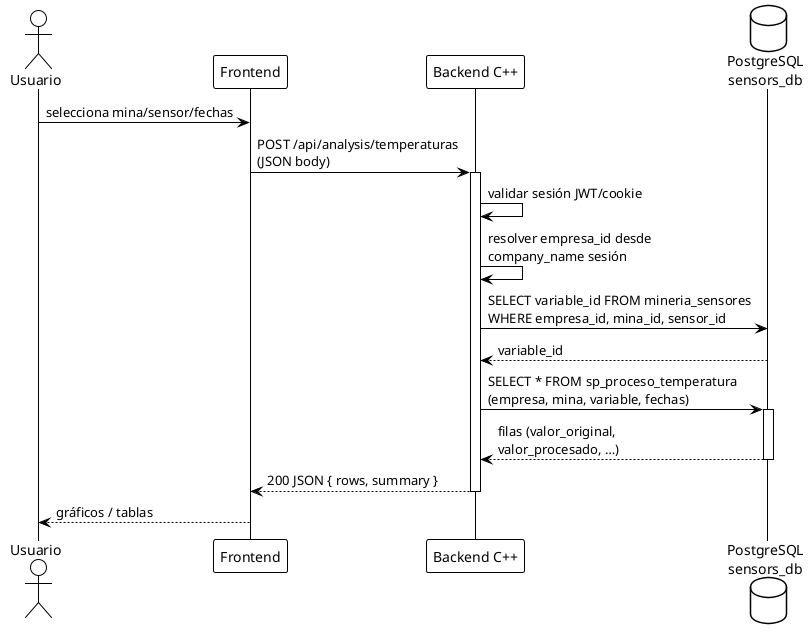
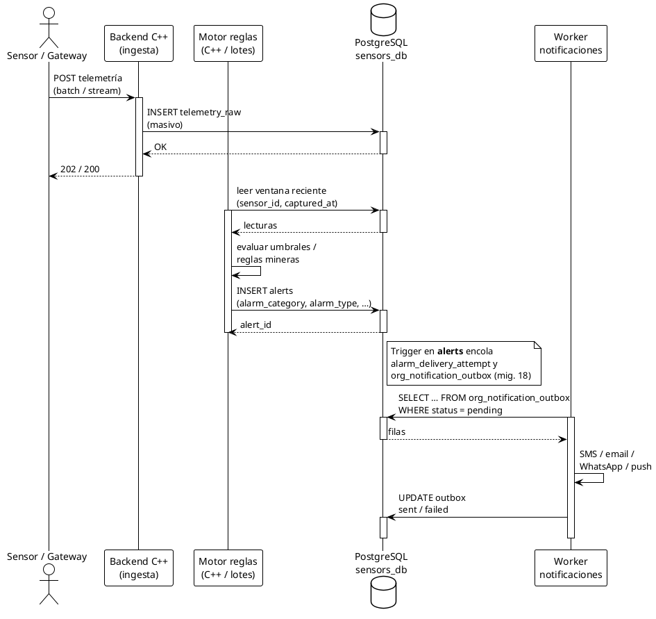
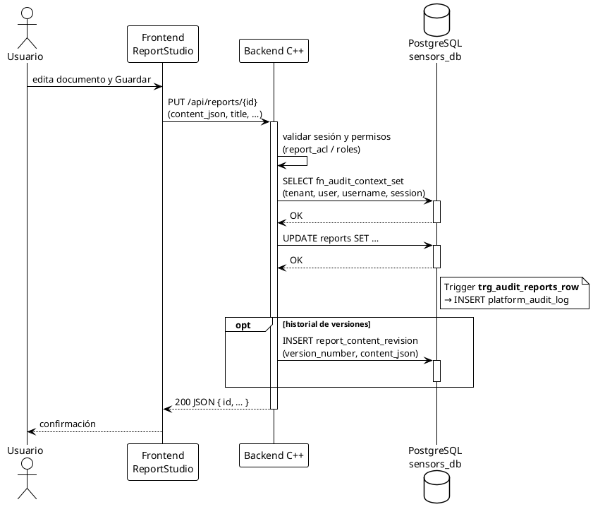
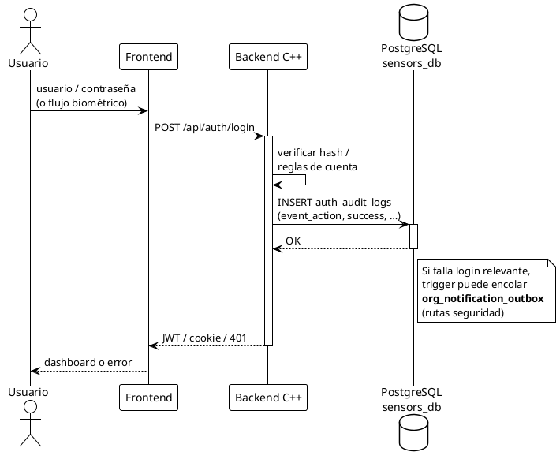
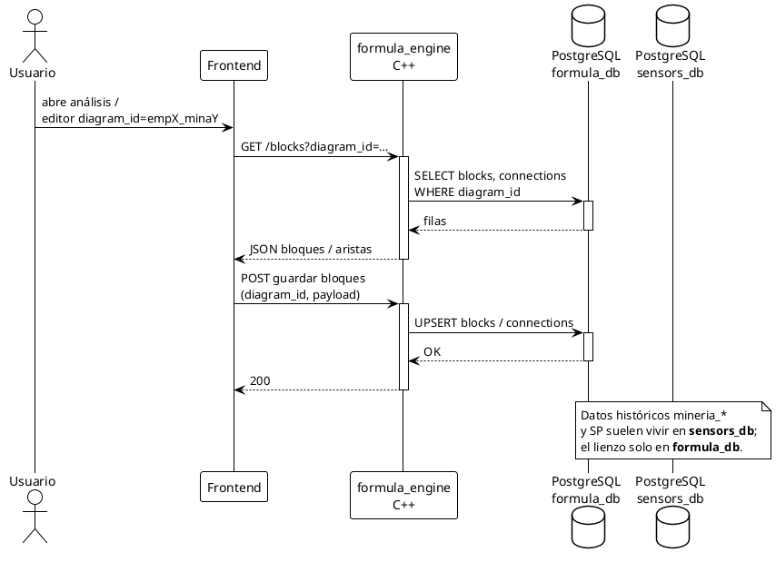
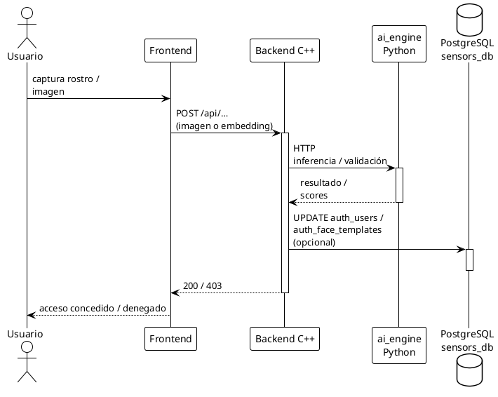
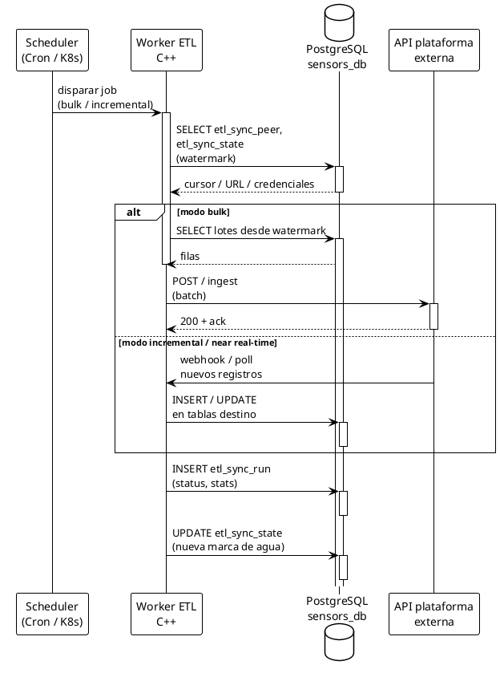
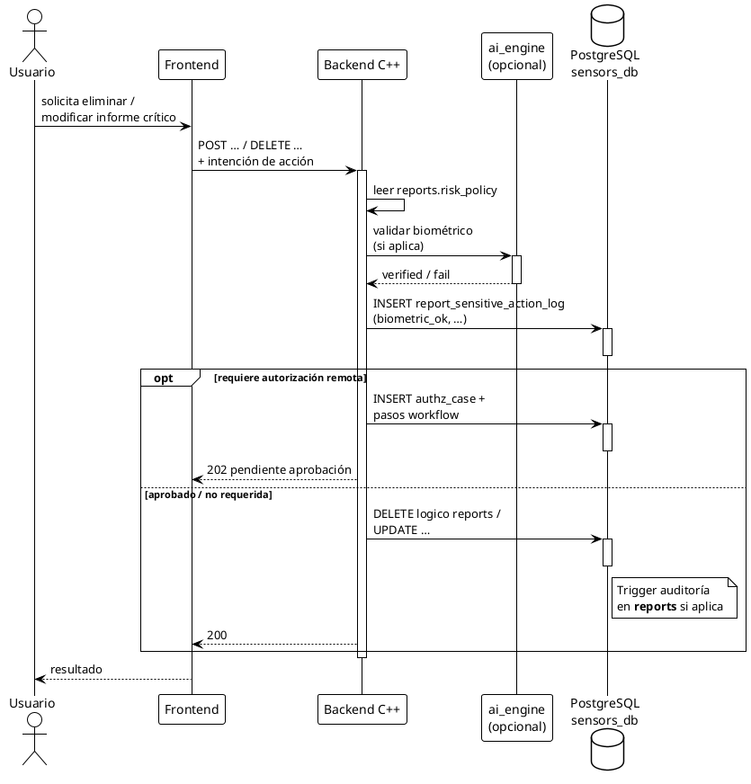
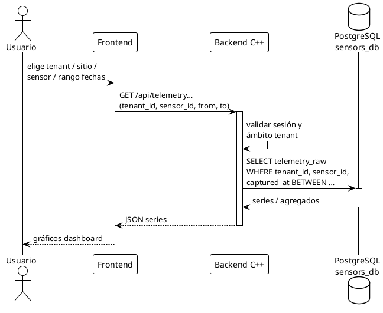

# Diagramas de flujo (PlantUML) — Plataforma minera InformeCliente

Colección de **diagramas de secuencia** en el mismo estilo que `C4_secuencia_analisis_temperaturas`. Cada bloque se puede copiar a un archivo `.puml` o pegar en [PlantUML en línea](https://www.plantuml.com/plantuml/).

**Sintaxis:** `@startuml` … `@enduml`, `!theme plain`, actores y participantes con flechas `->` / `-->`.

---

## 1. Análisis de temperaturas (API + SP en `sensors_db`)

---

## 2. Ingesta de telemetría y alarma en tiempo real (sin trigger por fila)

---

## 3. Guardado de informe técnico y auditoría en BD

---

## 4. Login con validación de sesión y registro en `auth_audit_logs`

---

## 5. Editor FORMULA (lienzo) vía `formula_engine` y `formula_db`

---

## 6. Motor de IA (biometría / imagen) — llamada desde backend

---

## 7. ETL / sincronización con plataforma externa

---

## 8. Acción sensible en informe (biométrico + autorización remota)

---

## 9. Consulta de telemetría v2 (multitenant) para dashboard

---

*Índice alineado a `DIAGRAMA_ARQUITECTURA_BD.md`, migraciones `db_scripts/` y despliegue típico Docker.*
