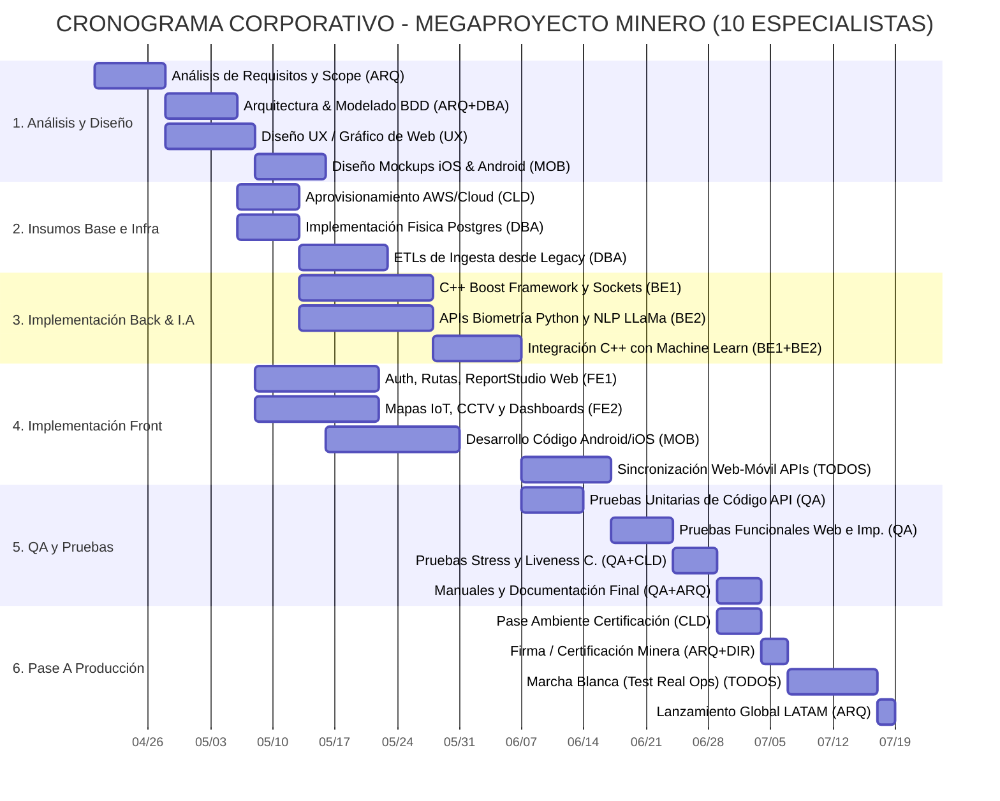

# Documento Estructurado para Presentación Gerencial (Formato PPTX)
## Cronograma Maestro: Plataforma Minera Premium (LATAM)

**Autor:** Arquitectura de Soluciones de TI Senior (LATAM)
**Enfoque Global:** Gestión Ágil de Proyectos por Asignación de Especialistas y Fases del SDLC.
*Nota: Este documento está estructurado lógicamente como "Diapositivas" (Slides) listas para ser exportadas e inyectadas en una presentación oficial PPTX ante el Directorio y la Gerencia Minera.*

---

### [DIAPOSITIVA 1] 👥 Estructura del Equipo de Desarrollo (10 Asignaciones)
Para garantizar la viabilidad del megaproyecto y ejecutar las fases en absoluto paralelismo, se ha requerido y asignado el siguiente escuadrón técnico de élite:
1. **(1) Arquitecto de Sistemas (ARQ):** Líder técnico, diseña la topología general y orquesta la sincronización de las áreas.
2. **(2) Analistas Senior Back End (BE1, BE2):** Responsables del motor C++ (Boost.Asio), los web-sockets mineros y conexiones a IA (Phyton, MediaPipe).
3. **(2) Analistas Frontend Senior (FE1, FE2):** Encargados de React 18, TipTap Editor, WebRTC Biométrico y mapas Leaflet.
4. **(1) Analista de Bases de Datos y ETL (DBA):** Modela y afina Postgres, TimescaleDB, particiones IOT y disparadores (Triggers).
5. **(1) Programador UI/UX & Diseñador Gráfico (UX):** Maqueta la experiencia visual de negocio y los flujos atractivos en alta fidelidad.
6. **(1) Diseñador/Programador Mobile (iOS / Android) (MOB):** Lleva la experiencia del Reporte y Dashboard al entorno Phone/Tablet bajo conectividad restrictiva.
7. **(1) Analista de Testing y Documentador (QA):** Crea escenarios de ruptura (Stress/Unitarios) y redacta los manuales del proyecto.
8. **(1) Analista Cloud Dev-Ops (CLD):** Aprovisiona Servidores, Dockers, balanceadores y la red segura.

---

### [DIAPOSITIVA 2] 🛠️ Etapa 1: Análisis y Arquitectura
*Fase donde se define la estrategia antes de codificar.*
*   **Levantamiento de Requerimientos y Scope:** (Resp: ARQ) Definición final de reglas de negocio minero.
*   **Arquitectura Base y Selección Tecnológica:** (Resp: ARQ + CLD) Aprobación de Dockers, Servidores y flujos de red corporativa.
*   **Modelado Estructural de Base de Datos DB:** (Resp: DBA + ARQ) Diseño de esquema Multi-tenant, Tablas Telemetría.

### [DIAPOSITIVA 3] 🎨 Etapa 2: Diseño UX, Interfaces Web y Estructuración Móvil
*Fase de construcción visual (Mockups y Prototipado).*
*   **Diseño Web App y ReportStudio:** (Resp: UX) Armado de Carátulas, Grillas, Dashboards interactivos y herramientas.
*   **Diseño Responsive y App Móvil:** (Resp: MOB) Adaptación de lectura en túneles (Offline), alertas y visualización CCTV en Smartphones.
*   **Preparación Servidores/Cloud:** (Resp: CLD) Paralelamente, se instalan entornos Linux transaccionales (AWS/Local).

### [DIAPOSITIVA 4] ⚙️ Etapa 3: Implementación Core (Backend, Modelos I.A e Infraestructura)
*La fase de pura capacidad computacional. (Operando en Paralelo a Front).*
*   **Pipeline 1: Motor C++ y Core Networking:** (Resp: BE1) Creación de Endpoints, Websockets y Autenticación Criptográfica.
*   **Pipeline 2: Inteligencia Artificial Python:** (Resp: BE2) Modelos ONNX, LLaMa-3, InsightFace Biométrico y NLP Ortográfico.
*   **Pipeline 3: Construcción BDD & ETLs:** (Resp: DBA) Ejecución de Tablas, Triggers de seguridad e ingesta de datos Legacy (Antiguos).

### [DIAPOSITIVA 5] 🖥️ Etapa 4: Implementación Frontend y Front-Mobile 
*Conversión visual hacia el código aplicativo final.*
*   **Construcción Vistas React y Motor Word/PPT:** (Resp: FE1) Permisos, Seguridad, Auto-guardado y Bóveda TipTap interactiva.
*   **Desarrollo Módulos GIS Lidar y Video Interactivo:** (Resp: FE2) Conexión a cámaras RTC, Dashboards vivos, y Mapas superpuestos.
*   **Desarrollo Native iOS/Android:** (Resp: MOB) Código del empaquetado móvil leyendo de forma directa desde la API C++.

### [DIAPOSITIVA 6] 🔬 Etapa 5: Pruebas Unitarias, Funcionales y QA
*Destrucción controlada de la plataforma para asegurar ISO/Compliance.*
*   **Pruebas Unitarias Automatizadas:** (Resp: QA) Ejecución scripts validando aislamientos, encriptación contraseñas y Biometría.
*   **Testing Funcional (End-to-End):** (Resp: QA + UX) Recorrido manual garantizando alineación de la Grilla, exportación e impresión 100% limpia.
*   **Stress Testing:** (Resp: QA + CLD) Simulador de 5,000 conexiones masivas simulando IOT Sensors a TimescaleDB.
*   **Documentación General:** (Resp: QA + ARQ) Creación de Manuales de usuario, arquitectura y diagramación final.

### [DIAPOSITIVA 7] 🚀 Etapa 6: Certificación y Pase a Producción
*El Go-Live Oficial Minero.*
*   **Despliegue a Servidores de Certificación:** (Resp: CLD) Pruebas de la Gerencia Cliente ("User Acceptance Testing UAT").
*   **Aprobación Gerencial y Firma del Cliente:** (Resp: ARQ + Directorio).
*   **Marcha Blanca Oculta (Beta):** Despliegue en Mina para que lo usen supervisores contados. Fallos de último minuto abordados rápido.
*   **Pase a Producción Global (Hard-Launch):** Sistema abierto, ETLs viejos apagados, Plataforma nueva asumiendo control LATAM absoluto.

---

### [DIAPOSITIVA 8] 📊 Cronograma Oficial Interactuable (Gantt Chart Maestro)
*Enfoque: Paralelismo y Optimización Masiva al operar recursos especializados en simultáneo.*

