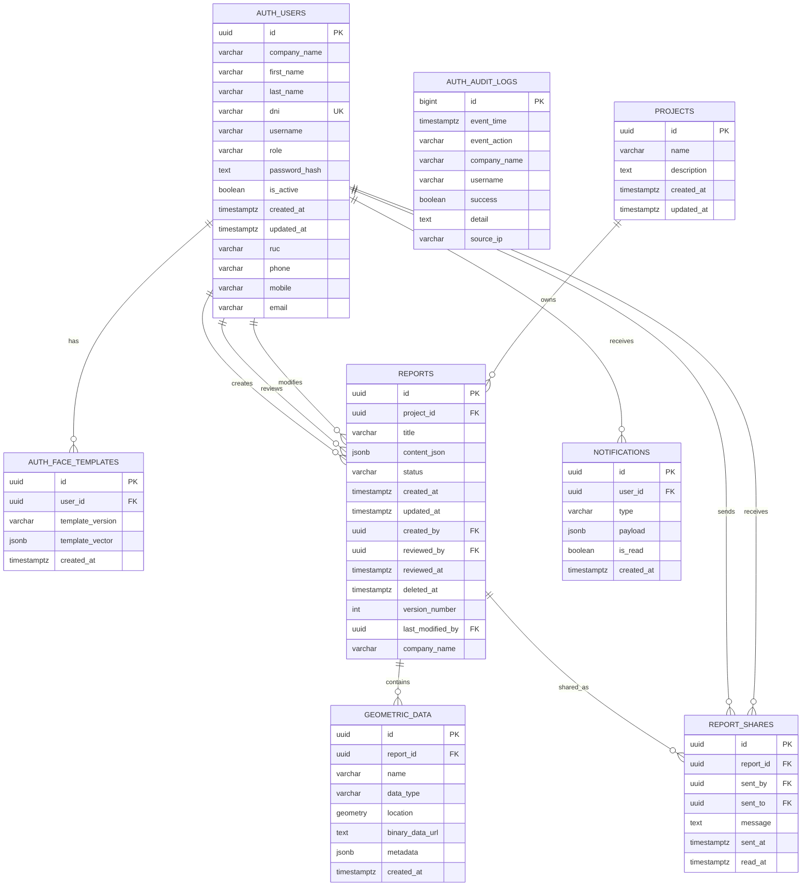
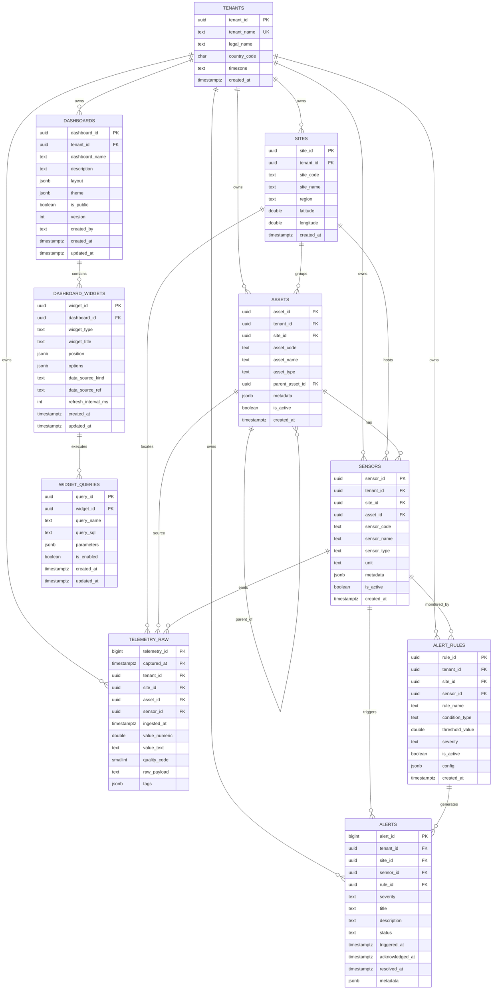
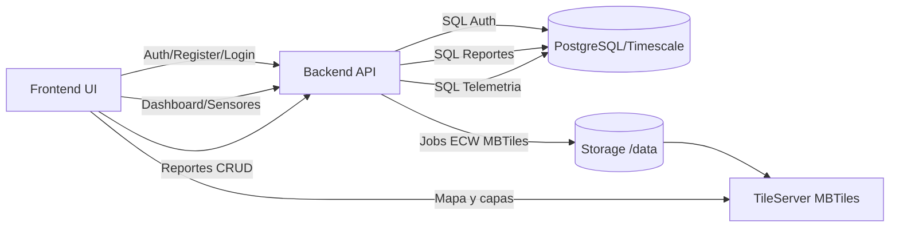

# Diagramas de Base de Datos - Presentacion Gerencia TI

Este documento representa la arquitectura de datos actualmente implementada en los scripts SQL del proyecto.

## 1) Modelo ER principal (Auth + Reportes + Comparticion)

## 2) Modelo ER de telemetria y dashboards (Timescale v2)

## 3) Flujo de datos operacional (alto nivel)

## 4) Observaciones para Gerencia TI

- El modelo de datos para auth, reportes y telemetria esta presente y extensible.
- Ya existen tablas para comparticion (`report_shares`) y notificaciones (`notifications`), pero su uso en API/Frontend aun no esta cerrado end-to-end.
- El esquema telemetrico esta preparado para crecimiento multi-tenant con Timescale.
- Se recomienda formalizar diccionario de datos y politicas de retencion por dominio (auth, reportes, telemetria).

