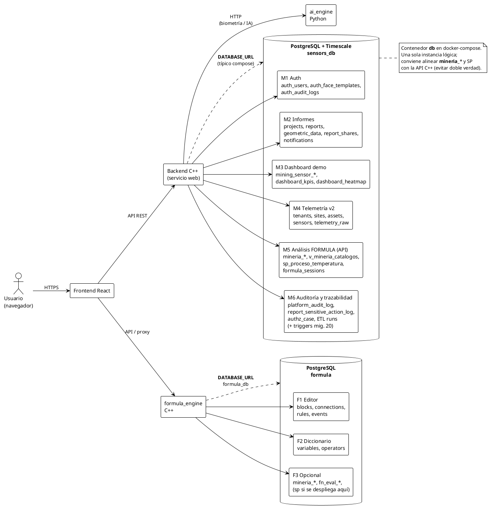
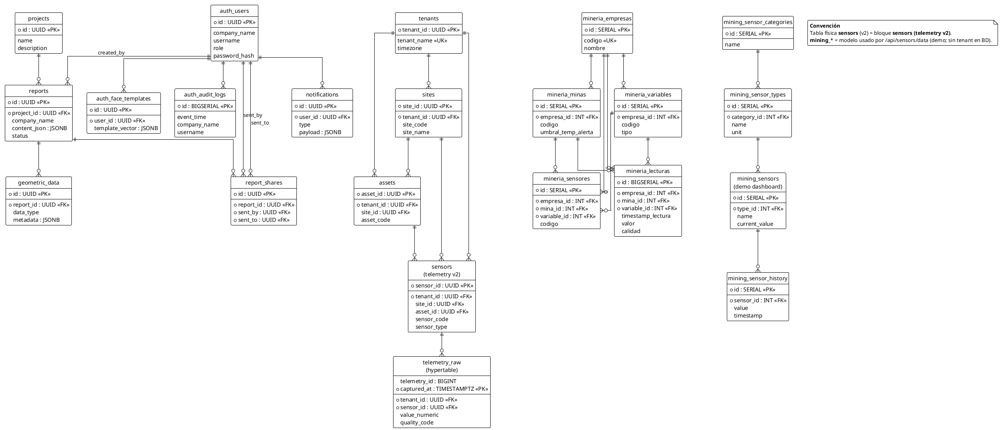
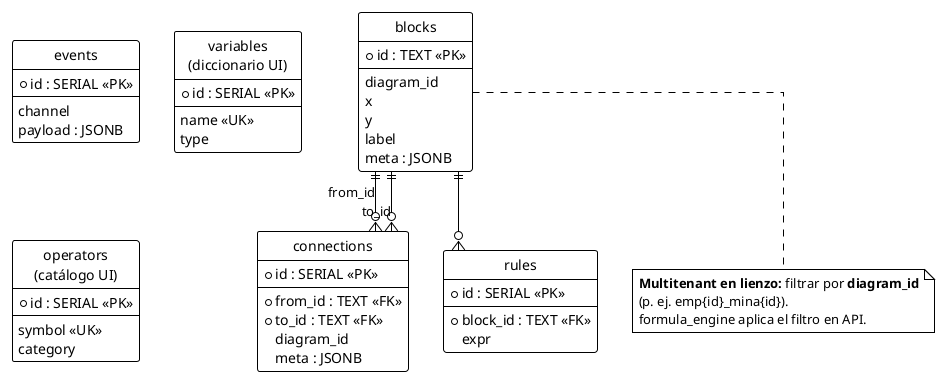
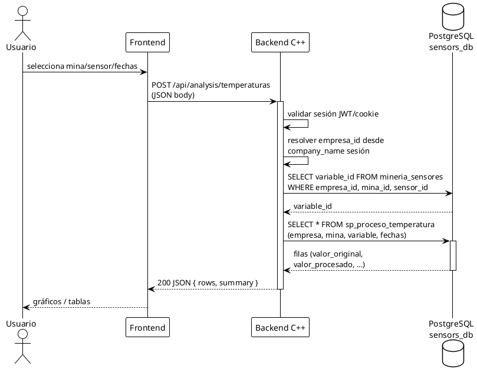
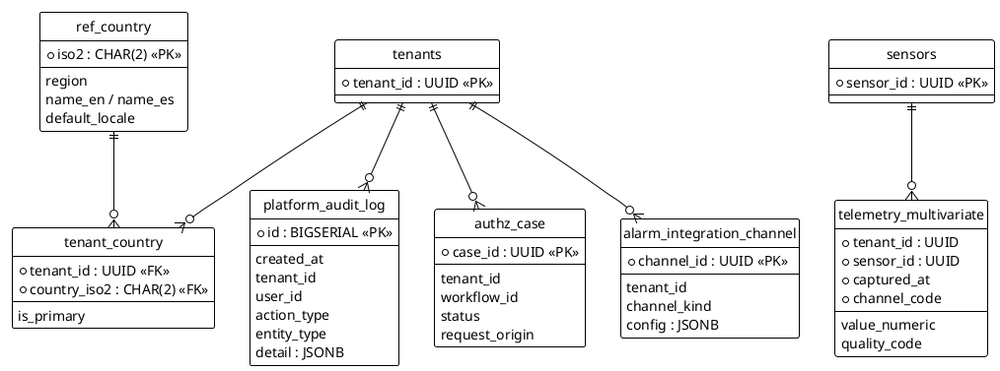

# Arquitectura de bases de datos — InformeCliente

Documento para **Gerencia TI** y **equipo técnico**: vista general, vista detallada, **qué es multitenant hoy**, **qué no lo es**, y **cómo debería quedar** para operación multi-cliente coherente.

**Presentación para gerencias (ejecutiva + TI detallada):** [`DISENO_BD_PRESENTACION_GERENCIAS.md`](DISENO_BD_PRESENTACION_GERENCIAS.md) — auditoría, trazabilidad, orden de migraciones `01`…`20`, brechas de instrumentación en backend.

**Formato de diagramas:** [PlantUML](https://plantuml.com/) (`@startuml` … `@enduml`). Copiar cada bloque en un archivo `.puml` o en [plantuml online](https://www.plantuml.com/plantuml/) / plugin VS Code / IntelliJ.

---

## 1. Vista general (lógica de despliegue)

**Lectura rápida**

- El **backend principal** usa **`sensors_db`** (contenedor `db`).
- El **motor FORMULA** (lienzo, bloques) usa **`formula`** (contenedor `formula_db`).
- Pueden existir **duplicados conceptuales** (`mineria_*` y SP en ambos lados) si no se gobierna con migraciones: eso debe alinearse en operación (ver sección 4).

---

## 2. Vista detallada — `sensors_db` (esquemas y relaciones)

> Nota: `telemetry_raw` es **hypertable** Timescale cuando la extensión está activa (`captured_at`).

**Convención en el diagrama**

- Entidad **sensors (telemetry v2)** = tabla `sensors` en `04_telemetry_schema_v2.sql` (IoT multitenant).
- **mining_sensors** = tablas usadas por `/api/sensors/data` (modelo demo).

---

## 3. Vista detallada — `formula` (editor y motor en BD)

**Multitenant en el lienzo**

- `diagram_id` sigue el criterio **`emp{id}_mina{id}`** (alineado con empresa/mina en análisis).
- Aislamiento: todas las consultas de bloques/conexiones deben filtrar por **`diagram_id`** (lo aplica el servicio `formula_engine`).

---

## 4. Secuencia — análisis de temperaturas (API + SP)

**Más diagramas de flujo (PlantUML)** en el mismo estilo: [`DIAGRAMAS_FLUJO_PLATAFORMA_MINERA.md`](DIAGRAMAS_FLUJO_PLATAFORMA_MINERA.md) (ingesta/alarmas, informes, auth, FORMULA, IA, ETL, acciones sensibles, telemetría v2).

Ejemplo en el estilo **mensaje con flechas** (como `Alice -> Bob`):

---

## 5. Qué **no** es multitenant hoy (o lo es solo a medias) — y cómo **debería** quedar

| Área | Estado actual | Riesgo | Modelo corregido (recomendado) |
|------|----------------|--------|---------------------------------|
| **`projects`** | Sin `tenant_id` / `company_name`. Proyectos **globales** a nivel tabla. | Mezcla conceptual de carteras entre empresas si no se filtra en app. | Añadir **`tenant_id` UUID** (FK a `tenants`) **o** `company_name` NOT NULL + índice; migrar datos; FK desde `reports` coherente con ese tenant. |
| **`reports`** | Tiene **`company_name`** (bien para filtrado lógico); **`project_id`** puede apuntar a proyecto sin tenant. | Informe “aislado por empresa” pero proyecto compartido por error. | **`project_id`** solo a proyectos del **mismo tenant**; constraint o validación en aplicación; ideal **`tenant_id`** redundante en `reports` para consultas rápidas. |
| **`mining_sensors` / `mining_sensor_history`** | Esquema demo: **sin `tenant_id`**. | Imposible garantizar segregación de datos por cliente a nivel BD. | Añadir **`tenant_id` UUID NOT NULL** (FK `tenants`) + índices `(tenant_id, id)`; o **deprecar** estas tablas y usar solo modelo v2 (`sensors` + `telemetry_raw`). |
| **`dashboard_kpis` / `dashboard_heatmap`** | Tablas planas sin tenant en scripts de generación. | KPIs mezclados entre clientes. | **`tenant_id`** en cada fila o vistas materializadas por tenant. |
| **Dos BDs (`sensors_db` vs `formula`) con `mineria_*`** | Posible **doble verdad** si el SP avanzado vive en `formula` pero la API C++ llama **`sensors_db`**. | Comportamiento distinto según dónde se desplegó el script. | **Una sola fuente de verdad** para `mineria_lecturas` y versión única de `sp_proceso_temperatura`; la otra BD solo editor (`blocks`/`connections`) o réplica controlada. |
| **Telemetría v2** | **`tenants` → `sites` → `sensors` → `telemetry_raw`**: diseño **correcto** multitenant. | Bajo uso si la UI sigue leyendo solo `mining_*`. | Exponer API y dashboards leyendo **este** modelo; migrar demos. |

---

## 6. Cómo identificar un registro de telemetría de un sensor en una mina (multitenant correcto)

**Modelo recomendado (v2)**

1. Resolver **`tenant_id`** (cliente / empresa contratante).
2. Resolver **`site_id`** (unidad minera / yacimiento) dentro de ese tenant.
3. Resolver **`sensor_id`** por **`(tenant_id, sensor_code)`** único.
4. Filtrar **`telemetry_raw`** por `tenant_id`, `sensor_id` (y opcionalmente `site_id`) y rango **`captured_at`**.

**Modelo actual análisis FORMULA (`mineria_*`)**

1. **`empresa_id`** (tenant de negocio minero).
2. **`mina_id`**.
3. **`variable_id`** (tipo de medida); el **sensor físico** está en **`mineria_sensores`** enlazando empresa + mina + variable + `codigo`.
4. Lecturas en **`mineria_lecturas`** por esas tres claves + tiempo.

**Recomendación de convergencia**

- Mantener **`tenant_id` UUID** como identidad global TI.
- Tabla puente o vista: `mineria_sensores` ↔ `sensors` (v2) para no duplicar semántica.

---

## 7. Extensiones de plataforma (migraciones `16_*` … `20_*`)

Scripts nuevos en el repositorio:

| Script | Propósito |
|--------|-----------|
| `db_scripts/16_platform_multitenant_latam_i18n_rbac_audit.sql` | Países (`ref_country`), locales BCP 47 (`ref_locale`), países por tenant (`tenant_country`), i18n (`i18n_entry`), `tenant_id` en `projects`/`reports`, enlace `mineria_empresas.tenant_id` y `mineria_minas.site_id`, membresía usuario–tenant (`auth_user_tenant`), RBAC (`sec_permission`, `sec_role`, `sec_role_permission`, `auth_user_role`), auditoría amplia (`platform_audit_log`, `fn_platform_audit_insert`), flujos de autorización (`authz_workflow*`, `authz_case*`), integración de alarmas (`alarm_integration_channel`, `alarm_routing_rule`, `alarm_delivery_attempt`, `fn_alarm_enqueue_deliveries`), registro de jobs ETL (`etl_job_definition`, `etl_job_run`). |
| `db_scripts/17_telemetry_multivariate_sensor_specs.sql` | Parámetros de cómputo por sensor (`sensor_input_parameter_def`), canales de salida (`sensor_output_channel_def`), serie multivariante (`telemetry_multivariate`, hypertable si hay Timescale), `mineria_sensores.iot_sensor_id`, vista `v_sensor_tenant_geo`. |
| `db_scripts/18_tb_sensor_model_notify_etl_triggers.sql` | Perfil TB-like (`sensor_profile`), atributos con scope (`sensor_attribute_kv`), credenciales de ingesta (`sensor_ingest_credential`), columnas de identificación en `sensors`, `alarm_category` / `alarm_type` en `alerts`, notificaciones org (`org_notify_*`, `org_notification_outbox`), sincronización externa (`etl_sync_peer`, `etl_sync_state`, `etl_sync_run`), cola `sensor_process_alarm_queue`, triggers en `alerts` / `auth_audit_logs` / cola de proceso (ver §10). |
| `db_scripts/19_report_technical_mining_enterprise.sql` | Informe técnico minero: columnas extra en `reports` (clasificación, `risk_policy`, `ai_assist_prefs`, visibilidad), `report_document_settings` (cabeceras, carátula, marcas de agua), `report_content_revision`, `report_embedded_asset`, grupos `report_share_group` / `report_acl`, flujo `report_submission` + destinatarios, `report_export_job` (docx/pdf/pptx/mp4), `report_ai_run`, `report_sensitive_action_log` (biométrico + `authz_case`), permisos `reports.*` adicionales. |
| `db_scripts/20_audit_traceability_enforcement.sql` | `fn_audit_context_set` / `fn_audit_context_clear`, índices `(entity_type, entity_id)` y `session_id` en `platform_audit_log`, triggers: `reports` → auditoría, `auth_users` (campos sensibles) → auditoría, `formula_sessions` INSERT → auditoría. |
| `formula_engine/02_multitenant_scope_registry.sql` | En **formula_db**: `formula_diagram_scope` para alinear `diagram_id` con `sensors_tenant_id` / `empresa_id` / `mina_id` **sin FK entre BDs**. |

**Alineación con ideas de ThingsBoard** (`C:\thingsboard-master`, p. ej. `schema-entities.sql`): tenant explícito, entidades con `tenant_id`, `alarm` + comentarios, `audit_log` con acción y payload serializado. Aquí se adopta el **espíritu** del modelo (multitenant, trazabilidad, enrutamiento de alarmas) en tipos PostgreSQL modernos (`JSONB`, `TIMESTAMPTZ`, partición vía Timescale donde aplique), sin copiar el esquema TB literal (usa `bigint` epoch y varchar masivos pensados para su capa Java).

---

## 8. Dos instancias de BD, millones de lecturas y ejecución continua

**Separación recomendada**

- **`sensors_db`**: telemetría (`telemetry_raw`, `telemetry_multivariate`), tenants/sites/sensors, alarmas, auditoría de plataforma, RBAC operativo, `mineria_*` y SP analíticos que consuma el **backend C++** en tiempo real. Es la **fuente de verdad** operativa.
- **`formula_db`**: lienzo (`blocks`, `connections`, `rules`), diccionario UI, `formula_diagram_scope`. No duplicar `mineria_lecturas` ni SP pesados aquí salvo estrategia explícita de réplica; el `formula_engine` en C++ debe leer/escribir diagramas y delegar datos históricos a `sensors_db` vía API o conexión secondaria.

**Rendimiento y 24×7**

- **No** ejecutar un stored procedure por cada fila de sensor en bucle desde el programador de la BD: escala mal. Patrón recomendado: **ingesta masiva** (batch/WAL) hacia `telemetry_raw`; **workers C++** (Boost.Asio + colas) que procesen ventanas de tiempo o mensajes; **Timescale** continuous aggregates o agregados por ventana para consultas; SP/funciones SQL para **lotes** (`WHERE captured_at BETWEEN …`) o mantenimiento.
- **Programación**: `etl_job_definition` + `etl_job_run` registran quién ejecutó qué; el disparo puede ser **pg_cron**, Kubernetes CronJob, o un **scheduler interno** en el servicio C++ con jitter y `FOR UPDATE SKIP LOCKED` si en el futuro se usa tabla de colas en PG.
- **Alarmas**: el trigger `trg_alerts_after_insert_fanout` (migración 18) invoca **`fn_alarm_enqueue_deliveries`** y el fan-out a personas/grupos (**`fn_org_notify_fanout_for_alert`** → `org_notification_outbox`). Los workers C++ consumen **`alarm_delivery_attempt`** (webhooks/SCADA) y **`org_notification_outbox`** (email/SMS/WhatsApp/push). Desactivación puntual de fan-out en sesión: `SET app.alert_fanout = 'off'`.

**Sensores con N entradas y M salidas**

- Entradas: filas en `sensor_input_parameter_def` (o defaults en `sensors.metadata` para prototipos).
- Salidas: definición en `sensor_output_channel_def`; valores en `telemetry_multivariate` compartiendo `captured_at` y distinto `channel_code`. El motor numérico (C++/ONNX/Python) escribe resultados en batch.

**Auditoría y permisos**

- Login y biometría: sigue `auth_audit_logs`.
- Resto de API (informes, telemetría, aprobaciones, alarmas): `platform_audit_log` vía `fn_platform_audit_insert` desde el backend.
- Autorización fina: comprobar `auth_user_role` + `sec_role_permission` en middleware C++ (cache por tenant/usuario); flujos sensibles pasan por `authz_case` con `approval_scope` local/remoto.

---

## 9. Uso y renderizado

- **PlantUML:** [https://plantuml.com/](https://plantuml.com/) — sintaxis `@startuml` / `@enduml`.
- **VS Code:** extensión “PlantUML” (requiere Java y Graphviz según configuración).
- **CLI:** `java -jar plantuml.jar archivo.puml` → PNG/SVG para PowerPoint.

---

## 10. Modelo ThingsBoard por sensor, triggers y notificaciones (migración `18`)

### 10.1 Cómo ThingsBoard modela un “device” y el equivalente aquí

En **ThingsBoard** (`schema-entities.sql`, `schema-ts-psql.sql`) un dispositivo combina:

| Concepto TB | Rol | Equivalente en esta plataforma |
|-------------|-----|--------------------------------|
| `device_profile` | Tipo, transporte, `profile_data` JSON (comportamiento por familia de equipos) | `sensor_profile` + `profile_data` |
| `device` | Identidad: `name`, `label`, `external_id`, `tenant_id`, vínculo al perfil | `sensors` (`sensor_code`, `sensor_name`, `label`, `external_id`, `serial_number`, `sensor_profile_id`, `tenant_id`, `site_id`, `asset_id`) |
| `attribute_kv` | Propiedades **server** / **client** / **shared** (no series temporales) | `sensor_attribute_kv` (`scope`, `attr_key`, `value_json`) |
| `device_credentials` | Autenticación de ingesta (MQTT, token, etc.) | `sensor_ingest_credential` (`secret_hash`, nunca claro) |
| `ts_kv` | Telemetría serie temporal | `telemetry_raw` (serie principal) + `telemetry_multivariate` (M canales por instante) |
| Reglas / alarmas | **Rule engine** (Java), no triggers SQL por muestra | Inserción en **`alerts`** (+ categoría `alarm_category`, código `alarm_type`) desde C++ o desde **`sensor_process_alarm_queue`**; triggers solo en estas tablas de **bajo volumen** |

**Parámetros de entrada** al algoritmo de un sensor (calibración, factores de corrección, límites): `sensor_input_parameter_def` y/o `sensor_attribute_kv` scope `server` (operador) o `shared`.

**Datos que lee** el sensor (mediciones): filas en `telemetry_raw` y, si el procesamiento emite varias magnitudes, en `telemetry_multivariate` con `channel_code` alineado a `sensor_output_channel_def`.

### 10.2 Encaje con ejecución en tiempo real en C++

- **Hot path**: ingesta masiva → `telemetry_raw` (y opcionalmente `telemetry_multivariate`). **No** poner triggers `AFTER INSERT` en `telemetry_raw` para alarmas o notificaciones: destruye el throughput.
- **Motor de reglas** (equivalente TB rule nodes): servicio C++ que lee ventanas o flujo de mensajes (Boost.Asio, colas), evalúa umbrales y escribe **`alerts`** o **`sensor_process_alarm_queue`**.
- Al insertar en **`alerts`**, el trigger encola integraciones técnicas y mensajes humanos según `org_notify_route` (severidad, categoría, sitio, tipo).
- **Seguridad / acceso indebido**: trigger en **`auth_audit_logs`** (fallos de login/auth/biometría) con rutas `org_notify_route` donde `alarm_category = 'security'`; resuelve `tenant_id` vía `auth_users` + `auth_user_tenant`.
- **Desactivar notificaciones** en cargas masivas de prueba: `SET app.security_notify_fanout = 'off'` en la sesión que inserta auditoría.

### 10.3 ETL hacia otra plataforma

- **Definición del peer**: `etl_sync_peer` (URL, `auth_config`, dirección push/pull/bidireccional).
- **Estado**: `etl_sync_state` por `stream_code` (marca de agua temporal o `watermark_bigint` para IDs).
- **Ejecuciones**: `etl_sync_run` (modos `bulk`, `incremental`, `realtime_forward`). Los jobs programados pueden seguir usando `etl_job_definition` / `etl_job_run`; el worker C++ implementa llamadas HTTP/gRPC al peer y actualiza cursores **después** de commit exitoso (patrón at-least-once + idempotencia en destino).

### 10.4 Qué faltaría para un estándar “premium enterprise” de primer mundo

- **Proveedores**: conectores reales (SendGrid, SES, Twilio, Meta WhatsApp Business API, FCM, Teams webhooks) en servicio dedicado, no en PL/pgSQL.
- **Plantillas** multilenguaje por canal (`i18n_entry` + plantillas por `tenant_id`).
- **Consentimiento y opt-out** (RGPD / normativa local), horarios de silencio, escalado on-call.
- **Cifrado** de `auth_config` / secretos (KMS, Vault); rotación de `sensor_ingest_credential`.
- **Observabilidad**: métricas Prometheus, trazas OpenTelemetry en workers de notificación y ETL.
- **Pruebas de carga** en telemetría y deduplicación de outbox (mismo alerta → mismo destinatario).
- **Alta disponibilidad** PostgreSQL (réplicas lectura, failover), partición de `org_notification_outbox` / `platform_audit_log` si crecen sin límite.

---

## 11. Informe técnico minero (ReportStudio) — migración `19`

- **Contenido completo:** `reports.content_json` (vigente) + historial en **`report_content_revision`** por `version_number` alineado a `reports.version_number`.
- **Diseño / export:** cabeceras, pies, carátula, marcas de agua y márgenes en **`report_document_settings`** (JSON estructurado consumido al generar DOCX/PDF/PPTX/MP4).
- **Medios embebidos:** **`report_embedded_asset`** (URI + `sha256`); mapas, dashboards capturados, imágenes.
- **Permisos:** roles globales (`sec_permission`) + **`report_acl`** por usuario o **`report_share_group`**; `sharing_visibility` controla si el informe es privado, abierto al tenant o solo vía ACL.
- **Workflow:** **`report_submission`** (`for_review`, `for_approval`, avisos) y **`report_submission_recipient`**; opcional **`authz_case_id`** para aprobación remota supervisada.
- **Notificaciones:** la app encola en **`org_notification_outbox`** (migración 18) al crear envíos; `notify_channel_prefs` en destinatarios guarda intención por fila.
- **Exportaciones:** **`report_export_job`** con `export_format` ∈ docx, pdf, pptx, mp4, etc.
- **IA:** **`report_ai_run`** registra ortografía, voz→texto, revisión, recomendaciones genéricas o modelo fine-tuned (`model_id`).
- **Acciones de riesgo:** antes de modificar/borrar según **`reports.risk_policy`**, insertar en **`report_sensitive_action_log`** (biométrico + enlace a **`authz_case`**).

*Documento alineado al código en el repositorio (scripts `db_scripts/`, `formula_engine/*.sql`, rutas backend). Revisar tras cada migración mayor.*
